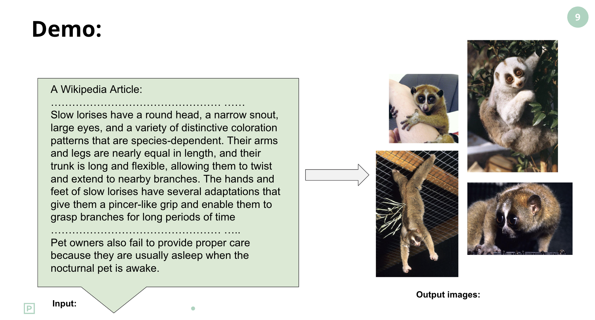

# 📰📷 Image-Recommendation-for-Wikipedia-Articles

This project develops a multimodal matching system that recommends relevant images for Wikipedia articles using advanced deep learning techniques. By enhancing the visual context of Wikipedia, we aim to improve reader engagement and accessibility, particularly for visual learners and second-language readers.

## 📦 Dataset
Our dataset includes:
- **5,000+** featured Wikipedia articles
- **30,000+** associated images with metadata (title, URL, and description)
Original dataset download link: https://drive.google.com/file/d/1l0Oyv2Y6LmPGN3lP9MB6i8WWCinqkYPk/view

We focused on high-quality, curated articles with minimal missing data. Edge cases such as articles with excessive image fragments were identified and handled.

## 🧠 Methodology

### 1. **Baseline: Word2VisualVec**
- **Text Encoder**: Combination of Bag of Words (BoW), Word2Vec, and GRU
- **Image Encoder**: ResNet-152 (2048-dim vector)
- Text and image vectors projected into a common space using regression and compared using cosine similarity

### 2. **Advanced: MTProp (Multi-modal Text Proposal)**
- **Text Encoder**: XLM-RoBERTa + Transformer Encoder
- **Image Encoder**: CLIP ViT-B/32
- **Two versions**:
  - **Without image**: URL and caption-only matching
  - **With image**: CLIP + URL + caption via attention-based fusion

 
### 3. **Model Improvement**
#### a. **MTProp with LLM-driven**
- Uses Flan-T5 to extract 512-token text snippets relevant to each image
- Enables training on focused (image, text) pairs

#### b. **MTProp with Text Sliding-Window**
- Splits long text into multiple fragments (128 tokens with 64 tokens overlapping)
- Compares images to each fragment individually for finer-grained matching

## 📊 Evaluation Results

| Model                          | Recall@1 |      Recall@5      | Recall@10 |
|--------------------------------|----------|--------------------|-----------|
| Word2VisualVec                 |   7.2%   |   20.2%(Recall@3)  |   28.3%   |
| MTProp (Text-only)             |   8.87%  |        44.33%      |   88.65%  |
| MTProp (Multimodal)            |   7.5%   |       27.03%       |   43.44%  |
| MTProp with LLM-driven         |          |                    |           |
| MTProp with Text Sliding-Window|  47.88%  |       86.73%       |   94.64%  |

## 🔍 Analysis
- MTProp outperforms the baseline by better leveraging semantic embeddings via XLM-RoBERTa.
- Surprisingly, MCProp **without** image features outperformed the multimodal version, likely due to:
  - Long input texts exceeding XLM-RoBERTa’s optimal length (512 tokens)
  - Modality fusion noise from unrelated visual information
- Improvement directions:
  - More effective fusion strategies
  - Better segmentation of input text
  - Enhance local alignments between text and images via pseudo-label filtering
- MTProp with Text Sliding-Window dramatically outperforming earlier models. This confirms that splitting long Wikipedia articles into smaller, focused text fragments significantly enhances retrieval performance by better isolating semantically relevant content.

## 📜 References
1. Onyshchak, Oleh, and Miriam Redi. *Image Recommendation for Wikipedia Articles*. 2019.  
2. Messina et al. *Transformer-Based Multi-modal Proposal and Re-Rank for Wikipedia Image-Caption Matching*. 2022.

